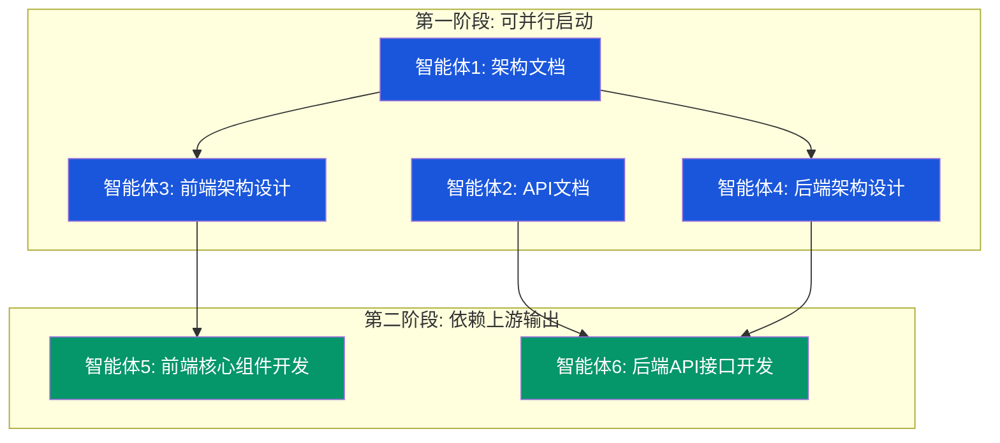

# OpenClaw U盘便携版桌面管理器 -- 6智能体并行任务方案

> 版本: 1.0 | 日期: 2026-05-04 | 基于项目实际代码结构编写

---

## 目录

1. [项目现状分析](#1-项目现状分析)
2. [智能体依赖关系图](#2-智能体依赖关系图)
3. [关键路径分析](#3-关键路径分析)
4. [接口契约定义](#4-接口契约定义)
5. [智能体1: 架构文档](#5-智能体1-架构文档)
6. [智能体2: API文档](#6-智能体2-api文档)
7. [智能体3: 前端架构设计](#7-智能体3-前端架构设计)
8. [智能体4: 后端架构设计](#8-智能体4-后端架构设计)
9. [智能体5: 前端核心组件开发](#9-智能体5-前端核心组件开发)
10. [智能体6: 后端API接口开发](#10-智能体6-后端api接口开发)
11. [并行工作冲突规避规则](#11-并行工作冲突规避规则)
12. [集成验证计划](#12-集成验证计划)

---

## 1. 项目现状分析

### 1.1 已有代码清单

| 层级 | 文件 | 行数 | 说明 |
|------|------|------|------|
| 授权服务端 | `license_server/server.py` | 850 | Python HTTP 服务, SQLite + Ed25519 签名, 含管理后台 HTML |
| Rust 核心 | `src-tauri/src/lib.rs` | 169 | Tauri 2.0 入口, 启动 Python Bridge, 代理请求 |
| Tauri 配置 | `src-tauri/tauri.conf.json` | 46 | 窗口标题硬编码 "永浩科技", 资源打包 python/ |
| Cargo 依赖 | `src-tauri/Cargo.toml` | 27 | tauri 2.11, reqwest 0.12 |
| Python Bridge | `python/bridge.py` | 506 | HTTP API 路由层, 16 个 API 端点, Token 鉴权 |
| 路径发现 | `python/core/paths.py` | 127 | AppPaths dataclass, 便携目录结构探测 |
| 存储工具 | `python/core/storage.py` | 39 | read_json/write_json/update_json |
| 常量配置 | `python/core/constants.py` | 95 | **硬编码** BRAND/COLORS/FONTS/PROVIDERS (永浩科技主题) |
| 授权管理 | `python/core/license_manager.py` | 147 | 在线激活 + 本地 Ed25519 验证 + 硬件绑定 |
| 进程管理 | `python/services/process.py` | 108 | Node.js 子进程启停, taskkill 清理 |
| 图片生成 | `python/services/image_api.py` | 100 | OpenAI 图片 API 客户端 (gpt-image-2) |
| 视频生成 | `python/services/video_api.py` | 128 | DashScope 视频异步任务客户端 |
| 更新服务 | `python/services/updater.py` | 86 | pnpm view/add openclaw@latest |
| React 入口 | `src/App.tsx` | 417 | 主布局, 页面路由, API/飞书配置弹窗 |
| 前端 API | `src/services/api.ts` | 96 | Tauri invoke 代理, 7 个 API 命名空间 |
| 状态管理 | `src/stores/appStore.ts` | 73 | Zustand, 授权状态 + localStorage 持久化 |
| 日志存储 | `src/stores/logStore.ts` | 23 | Zustand, 100KB 截断 |
| 类型定义 | `src/types/index.ts` | 101 | License/Scene/StoryboardProject 等 |
| 通用组件 | `src/components/common/index.tsx` | 154 | Button/Input/TextArea/Select/Modal/Toast/Loading/FieldLabel |
| 侧边栏 | `src/components/sidebar/Sidebar.tsx` | 125 | **硬编码** "永浩科技" + NAV_ITEMS |
| 授权页面 | `src/components/license/LicensePage.tsx` | 128 | 在线激活, 状态展示 |
| 终端页面 | `src/components/terminal/TerminalPage.tsx` | 65 | 日志查看, 自动滚动 |
| 图片页面 | `src/components/image/ImagePage.tsx` | 202 | 单图/三图生成, 配置持久化 |
| 视频页面 | `src/components/video/VideoPage.tsx` | 191 | 文生/图生视频, DashScope |
| 分镜页面 | `src/components/storyboard/StoryboardPage.tsx` | 520 | 三栏布局, 九宫格, 首尾帧, 视频生成 |
| Tailwind 配置 | `tailwind.config.js` | 22 | **硬编码** 永浩科技色板 |
| 旧主题系统 | `openclaw_launcher/themes/` | - | registry.json + theme.json, 需重设计 |

### 1.2 核心问题: 品牌硬编码

当前代码中品牌信息分散在 6 个位置,全部硬编码为 "永浩科技":

1. `python/core/constants.py` -- `BRAND["name"]`, `BRAND["subtitle"]`, `COLORS`, `FONTS`
2. `src-tauri/tauri.conf.json` -- `"title": "永浩科技 - 智能AI服务平台"`
3. `src/components/sidebar/Sidebar.tsx` -- 品牌名和副标题
4. `tailwind.config.js` -- 色板值
5. `src/App.tsx` -- 弹窗标题等
6. `src/components/common/index.tsx` -- 组件样式引用 tailwind token

**目标**: 同一个 exe, 根据授权码激活后加载对应商家的品牌 UI, 包括品牌名、Logo、色板、字体、功能模块可见性。

---

## 2. 智能体依赖关系图

### 2.1 Mermaid 依赖图



### 2.2 ASCII 依赖矩阵

```
                智能体1    智能体2    智能体3    智能体4    智能体5    智能体6
                架构文档   API文档    前端架构   后端架构   前端组件   后端开发
智能体1          -         -         供给       供给       -         -
智能体2          -         -         -         供给       -         供给
智能体3          消费       -         -         -         供给       -
智能体4          消费       消费       -         -         -         供给
智能体5          -         -         消费       -         -         -
智能体6          -         消费       -         消费       -         -
```

### 2.3 可并行分组

| 阶段 | 可并行智能体 | 说明 |
|------|-------------|------|
| 第一阶段 | 智能体1 + 智能体2 + 智能体3 + 智能体4 | 四个智能体无互相依赖, 可同时启动 |
| 第二阶段 | 智能体5 + 智能体6 | 两者分别依赖前端/后端架构, 但互不依赖, 可并行 |

**注意**: 智能体3 和 智能体4 虽然都在第一阶段, 但智能体3 仅依赖智能体1, 智能体4 依赖智能体1 和智能体2. 实际操作中智能体3 可以在智能体1 输出关键架构决策后立即启动, 不必等智能体1 完成全部交付物.

---

## 3. 关键路径分析

### 3.1 关键路径

```
智能体1(架构决策) --> 智能体3(前端架构) --> 智能体5(前端组件) --> 集成验证
```

这条路径决定总工期, 因为:
- 智能体1 的品牌加载架构决策是所有后续工作的前提
- 智能体3 的 ThemeConfig 类型定义是智能体5 的消费依赖
- 智能体5 的组件开发是最终可交付物的核心

### 3.2 非关键路径

```
智能体2(API文档) --> 智能体4(后端架构) --> 智能体6(后端开发) --> 集成验证
```

这条路径有更多浮动时间, 因为:
- 智能体2 可以独立完成大部分文档 (基于现有 bridge.py 路由)
- 智能体4 的后端架构变化相对小 (主要新增主题 API)
- 智能体6 的后端开发量小于前端

### 3.3 里程碑时间线

```
T0    T1          T2          T3          T4
|-----|-----------|-----------|-----------|
 启动  架构决策就绪  第一阶段完成  第二阶段完成  集成验证
      (A1输出关键    (A1-A4交付)  (A5-A6交付)
       架构决策)
```

- **T0**: 6个智能体同时启动, 智能体1 优先输出架构决策
- **T1**: 智能体1 输出品牌加载架构决策, 智能体3/4 可开始消费
- **T2**: 第一阶段4个智能体完成全部交付物
- **T3**: 第二阶段2个智能体完成全部代码
- **T4**: 集成验证, 端到端测试

---

## 4. 接口契约定义

智能体之间的数据交换必须遵循以下类型契约, 确保并行开发不冲突.

### 4.1 ThemeConfig -- 品牌/主题配置 (核心契约)

**生产者**: 智能体3 (前端架构设计) + 智能体4 (后端架构设计, 数据库表)
**消费者**: 智能体5 (前端组件) + 智能体6 (后端 API)

```typescript
// src/types/theme.ts -- 智能体3 定义, 智能体5 消费

/** 品牌主题配置 -- 存储在 license_data.brand_config 中 */
export interface ThemeConfig {
  /** 商家唯一标识, 如 "yonghao_tech" */
  merchantId: string;

  /** 品牌信息 */
  brand: {
    name: string;           // "永浩科技"
    subtitle: string;       // "智能AI服务平台"
    logoUrl: string | null; // base64 data URL 或相对路径
    faviconUrl: string | null;
  };

  /** 色板 -- 映射到 Tailwind CSS 自定义属性 */
  colors: {
    accent: string;           // 主色 "#1A56DB"
    accentHover: string;      // 主色悬停 "#1444AD"
    accentSoft: string;       // 主色浅底 "#E4E8F0"
    accentInk: string;        // 主色深文字 "#0F327F"
    appBg: string;            // 应用背景 "#F3F4F5"
    sidebarBg: string;        // 侧边栏背景 "#F9F9FA"
    surface: string;          // 卡片/面板 "#FFFFFF"
    surfaceAlt: string;       // 次级面板 "#F6F7F8"
    text: string;             // 主文字 "#1E2A3A"
    textMuted: string;        // 次要文字 "#64748B"
    textSubtle: string;       // 辅助文字 "#94A3B8"
    border: string;           // 边框 "#E2E8F0"
    borderStrong: string;     // 强调边框 "#CBD5E1"
    success: string;          // 成功 "#059669"
    warning: string;          // 警告 "#D97706"
    danger: string;           // 危险 "#DC2626"
    terminalBg: string;       // 终端背景 "#0F172A"
    terminalHeader: string;   // 终端标题栏 "#1E293B"
    terminalText: string;     // 终端文字 "#34D399"
  };

  /** 字体配置 */
  fonts: {
    display: string;   // 标题字体 "Microsoft YaHei UI"
    body: string;      // 正文字体 "Microsoft YaHei UI"
    mono: string;      // 等宽字体 "Consolas"
  };

  /** 功能模块可见性 -- 根据授权码 features + 商家配置决定 */
  features: {
    terminal: boolean;     // 服务日志
    storyboard: boolean;   // 广告视频
    image: boolean;        // AI 生图
    video: boolean;        // AI 视频
    license: boolean;      // 授权码
    apiConfig: boolean;    // API 配置
    feishu: boolean;       // 飞书机器人
    webConsole: boolean;   // 网页界面
    updater: boolean;      // 检查更新
    help: boolean;         // 帮助文档
  };

  /** 窗口配置 */
  window: {
    title: string;        // 窗口标题 "永浩科技 - 智能AI服务平台"
    width: number;        // 默认宽度 1200
    height: number;       // 默认高度 800
  };

  /** 导航项配置 -- 可覆盖默认 NAV_ITEMS 的 label/desc/group */
  navItems?: NavItemOverride[];
}

export interface NavItemOverride {
  key: string;        // 对应 NAV_ITEMS 中的 key
  label?: string;     // 覆盖标签文字
  desc?: string;      // 覆盖描述文字
  icon?: string;      // 覆盖图标标识
  group?: string;     // 覆盖分组
  hidden?: boolean;   // 是否隐藏
}
```

### 4.2 LicenseData (扩展) -- 授权数据契约

**生产者**: 智能体4 (后端, 数据库设计) + 智能体6 (后端 API)
**消费者**: 智能体5 (前端 ThemeProvider 消费)

```typescript
// 在现有 License 类型基础上扩展

export interface License {
  licensee: string;
  edition: string;
  expires: string | null;
  features: string[];
  installId: string;
  deviceId?: string;
  signature: string;
  /** 新增: 商家品牌配置 -- 由授权服务器在激活时下发 */
  brandConfig?: ThemeConfig;
  /** 新增: 商家 ID -- 用于加载对应主题包 */
  merchantId?: string;
}
```

### 4.3 Bridge API 响应格式契约

**生产者**: 智能体2 (API文档) + 智能体6 (后端开发)
**消费者**: 智能体5 (前端 api.ts 调用)

```typescript
// 所有 Bridge API 统一响应格式
export interface BridgeResponse<T = unknown> {
  // 成功时: T 直接在顶层
  // 失败时: { error: string }
}

// 新增: 主题相关 API
export const themeApi = {
  /** 获取当前主题配置 (从 license 中提取) */
  current: (): Promise<{ theme: ThemeConfig }> =>
    api('/api/theme/current'),

  /** 根据 merchantId 获取主题配置 (离线回退) */
  getByMerchant: (merchantId: string): Promise<{ theme: ThemeConfig }> =>
    api('/api/theme/merchant', 'POST', { merchantId }),

  /** 列出所有可用主题 */
  list: (): Promise<{ themes: ThemeConfig[] }> =>
    api('/api/theme/list'),
};
```

### 4.4 Python 后端契约 -- 主题配置来源

**生产者**: 智能体4 (后端架构) + 智能体6 (后端开发)
**消费者**: 智能体5 (前端)

```python
# 主题配置的三级回退策略:
# 1. license_data["brandConfig"] -- 激活时服务器下发 (最优先)
# 2. data/themes/{merchantId}/theme.json -- 本地主题包 (离线回退)
# 3. DEFAULT_THEME -- 内置默认主题 (兜底)

# 新增 API 端点:
# GET  /api/theme/current   -- 返回当前生效的 ThemeConfig
# POST /api/theme/merchant  -- 根据 merchantId 查找本地主题包
# GET  /api/theme/list      -- 列出所有本地主题包
```

---

## 5. 智能体1: 架构文档

### 5.1 任务目标

输出系统总体设计文档, 明确品牌动态加载架构, 为所有其他智能体提供架构决策基础.

### 5.2 工作范围

**包含**:
- 系统总体架构图 (四层架构: 授权服务器 -> Rust/Tauri -> Python Bridge -> React UI)
- 核心模块功能说明 (基于现有代码)
- 品牌动态加载机制设计 (核心创新点)
- 数据流转图 (激活流程、主题加载流程、API 请求链路)
- 非功能需求 (安全性、性能、便携性、离线能力)
- 部署架构 (U盘便携版目录结构)

**不包含**:
- 具体 API 参数定义 (智能体2 负责)
- 前端目录结构 (智能体3 负责)
- 数据库表结构 (智能体4 负责)
- 组件代码 (智能体5 负责)
- 后端实现代码 (智能体6 负责)

### 5.3 输入依赖

无外部依赖. 输入为现有代码库.

### 5.4 输出物

| 文件 | 格式 | 说明 |
|------|------|------|
| `docs/architecture.md` | Markdown | 系统总体架构文档 |

### 5.5 详细任务清单

| 序号 | 任务 | 优先级 | 预估 | 说明 |
|------|------|--------|------|------|
| 1.1 | 绘制四层架构图 | P0 | 1h | 授权服务器 -> Rust/Tauri -> Python Bridge -> React UI, 标注进程边界和通信方式 |
| 1.2 | 描述核心模块功能 | P0 | 1h | 基于 server.py/bridge.py/lib.rs/App.tsx, 每个模块的职责和边界 |
| 1.3 | **设计品牌动态加载机制** | P0 | 2h | 核心决策: ThemeConfig 数据来源、三级回退策略、运行时切换流程 |
| 1.4 | 绘制激活+主题加载数据流 | P0 | 1h | 用户输入授权码 -> 服务器激活 -> 下发 brandConfig -> 前端应用主题 |
| 1.5 | 绘制 API 请求链路图 | P1 | 0.5h | 前端 -> Tauri invoke -> Rust proxy_request -> Python Bridge -> 服务 |
| 1.6 | 编写非功能需求 | P1 | 1h | 安全: Ed25519+硬件绑定; 性能: 启动<3s; 便携: 零安装; 离线: 本地验证 |
| 1.7 | 描述 U盘便携版目录结构 | P1 | 0.5h | 基于 paths.py 的实际目录规划 |
| 1.8 | 描述品牌切换流程 | P2 | 0.5h | 不同授权码激活同一 exe 时, 如何切换品牌 UI |

### 5.6 验收标准

1. 架构图清晰标注了四层边界和通信协议
2. 品牌动态加载机制有完整的三级回退策略 (服务器下发 > 本地主题包 > 默认主题)
3. 数据流图覆盖了从授权码输入到 UI 主题生效的完整路径
4. 非功能需求有量化指标
5. 其他智能体能基于此文档做出正确的架构决策

### 5.7 技术规范

- 使用 Mermaid 绘制架构图和数据流图
- 品牌加载机制必须兼容现有 Ed25519 签名验证流程
- 必须保持 U盘便携性, 不引入注册表或系统级依赖
- 主题配置数据量不超过 10KB (避免激活响应过大)

### 5.8 文件操作清单

**需读取**:

| 文件 | 目的 |
|------|------|
| `license_server/server.py` | 理解授权服务器架构和激活流程 |
| `src-tauri/src/lib.rs` | 理解 Rust 层如何启动 Bridge 和代理请求 |
| `python/bridge.py` | 理解 API 路由和鉴权机制 |
| `python/core/paths.py` | 理解目录结构和路径发现 |
| `python/core/license_manager.py` | 理解激活和验证流程 |
| `python/core/constants.py` | 理解现有品牌硬编码位置 |
| `src/App.tsx` | 理解前端主架构 |
| `src/services/api.ts` | 理解前端 API 调用链路 |
| `tailwind.config.js` | 理解现有色板定义 |
| `openclaw_launcher/themes/registry.json` | 参考旧版主题系统 |
| `openclaw_launcher/themes/merchants/yonghao_tech/theme.json` | 参考旧版主题包格式 |

**需创建**:

| 文件 | 说明 |
|------|------|
| `docs/architecture.md` | 系统总体架构文档 |

---

## 6. 智能体2: API文档

### 6.1 任务目标

输出所有 API 接口的完整文档, 包括现有 Bridge API 和新增的主题 API, 为后端开发提供精确的接口契约.

### 6.2 工作范围

**包含**:
- 现有 16 个 Bridge API 端点的完整文档 (基于 bridge.py)
- 授权服务器 3 个公开端点的文档 (基于 server.py)
- 新增 3 个主题 API 端点的文档 (新增)
- 统一的请求/响应格式规范
- 错误码体系
- 鉴权机制说明 (Bridge Token + Admin Token)

**不包含**:
- 后端实现代码 (智能体6 负责)
- 前端调用代码 (智能体5 负责)
- 数据库设计 (智能体4 负责)

### 6.3 输入依赖

- 智能体1 的品牌加载架构决策 (确定主题 API 的设计方向)

**最小化依赖**: 智能体2 可以先完成现有 16 个 API 的文档 (不依赖任何其他智能体), 仅新增的 3 个主题 API 需要等智能体1 确认品牌加载机制.

### 6.4 输出物

| 文件 | 格式 | 说明 |
|------|------|------|
| `docs/api-reference.md` | Markdown | 完整 API 参考文档 |

### 6.5 详细任务清单

| 序号 | 任务 | 优先级 | 预估 | 说明 |
|------|------|--------|------|------|
| 2.1 | 文档化进程管理 API | P0 | 0.5h | `/api/process/start`, `/api/process/stop`, `/api/process/status` |
| 2.2 | 文档化日志 API | P0 | 0.3h | `/api/log/get`, `/api/log/clear` |
| 2.3 | 文档化授权 API | P0 | 0.5h | `/api/license/current`, `/api/license/activate`, `/api/license/authorized` |
| 2.4 | 文档化图片生成 API | P0 | 0.5h | `/api/image/generate` (含 base64 上传说明) |
| 2.5 | 文档化视频生成 API | P0 | 0.5h | `/api/video/generate` (含 DashScope 异步任务) |
| 2.6 | 文档化更新 API | P1 | 0.3h | `/api/update/check`, `/api/update/do` |
| 2.7 | 文档化配置 API | P1 | 0.3h | `/api/config/read`, `/api/config/write` (含路径安全校验) |
| 2.8 | 文档化认证/系统 API | P1 | 0.3h | `/api/auth/profiles`, `/api/system/info` |
| 2.9 | 文档化授权服务器公开 API | P1 | 0.5h | `/activate`, `/public-key`, `/health` |
| 2.10 | 文档化授权服务器管理 API | P2 | 0.5h | `/admin/api/codes`, `/admin/api/codes/toggle`, `/admin/api/codes/clear`, `/admin/api/codes/hash`, `/admin/api/codes/delete` |
| 2.11 | 设计并文档化主题 API | P0 | 1h | `/api/theme/current`, `/api/theme/merchant`, `/api/theme/list` (需等智能体1 决策) |
| 2.12 | 编写错误码体系 | P1 | 0.5h | 统一错误码: 400/401/403/404/500, 业务错误码映射 |
| 2.13 | 编写鉴权机制说明 | P1 | 0.3h | Bridge Token 机制, Admin Token 机制, PROTECTED_PATHS |
| 2.14 | 编写请求/响应通用规范 | P2 | 0.3h | Content-Type, 编码, 日期格式等 |

### 6.6 验收标准

1. 每个 API 端点有完整的: URL、方法、请求参数、响应示例、错误码
2. 新增主题 API 与现有 API 风格一致
3. 错误码体系覆盖所有现有错误场景
4. 鉴权机制说明清楚 Token 的生成和校验流程
5. 智能体6 能直接根据此文档实现后端代码

### 6.7 技术规范

- API 路径统一使用 `/api/{模块}/{操作}` 格式
- 响应统一为 JSON, Content-Type: `application/json; charset=utf-8`
- 错误响应格式: `{"error": "错误描述"}`
- 时间格式: ISO 8601 UTC (如 `2026-05-04T12:00:00+00:00`)
- 分页参数 (如有): `page`, `pageSize`

### 6.8 文件操作清单

**需读取**:

| 文件 | 目的 |
|------|------|
| `python/bridge.py` | 提取所有 16 个 API 端点的参数和返回值 |
| `license_server/server.py` | 提取授权服务器端点和管理 API |
| `src/services/api.ts` | 参考前端实际调用方式 |

**需创建**:

| 文件 | 说明 |
|------|------|
| `docs/api-reference.md` | 完整 API 参考文档 |

---

## 7. 智能体3: 前端架构设计

### 7.1 任务目标

设计前端架构, 重点是 ThemeProvider 动态主题系统和品牌切换机制, 输出 ThemeConfig 类型定义 (供智能体5 消费), 目录结构规划, 页面路由设计.

### 7.2 工作范围

**包含**:
- 前端技术栈确认 (React 18 + TypeScript + Tailwind + Zustand)
- 目录结构重构方案 (支持多品牌)
- ThemeProvider 设计 (核心: CSS 自定义属性 + Tailwind 动态注入)
- 页面路由设计 (基于功能模块可见性动态路由)
- 状态管理设计 (appStore 扩展 themeState)
- 与 Python Bridge 的通信层设计 (api.ts 扩展)
- ThemeConfig 类型定义 (核心交付物, 接口契约)

**不包含**:
- 具体组件代码实现 (智能体5 负责)
- 后端 API 实现 (智能体6 负责)
- 架构总图 (智能体1 负责)

### 7.3 输入依赖

- 智能体1: 品牌动态加载架构决策 (ThemeConfig 的数据来源和回退策略)

**最小化依赖**: 智能体3 可以先完成大部分工作 (目录结构、路由设计、状态管理), 仅 ThemeProvider 的具体实现策略需要等智能体1 确认三级回退机制.

### 7.4 输出物

| 文件 | 格式 | 说明 |
|------|------|------|
| `docs/frontend-architecture.md` | Markdown | 前端架构设计文档 |
| `src/types/theme.ts` | TypeScript | ThemeConfig 类型定义 (接口契约) |

### 7.5 详细任务清单

| 序号 | 任务 | 优先级 | 预估 | 说明 |
|------|------|--------|------|------|
| 3.1 | **定义 ThemeConfig 类型** | P0 | 1h | 核心契约, 必须最先完成, 智能体5 消费此类型 |
| 3.2 | 设计 ThemeProvider 机制 | P0 | 2h | CSS 自定义属性方案: 将 ThemeConfig.colors 映射为 CSS 变量, Tailwind 通过 var() 引用 |
| 3.3 | 设计品牌加载流程 | P0 | 1h | App 启动 -> 检查 license -> 提取 brandConfig -> 应用主题; 无 license 时用默认主题 |
| 3.4 | 设计目录结构 | P1 | 0.5h | 新增 `src/providers/`, `src/hooks/`, `src/types/theme.ts`; 重组 components/ |
| 3.5 | 设计路由系统 | P1 | 0.5h | 基于 features 可见性的动态路由, 未授权时隐藏功能模块 |
| 3.6 | 扩展 appStore 设计 | P1 | 0.5h | 新增 `themeConfig: ThemeConfig | null`, `applyTheme()`, `loadTheme()` |
| 3.7 | 扩展 api.ts 设计 | P1 | 0.5h | 新增 `themeApi` 命名空间 |
| 3.8 | 设计 Tailwind 动态色板方案 | P0 | 1h | 关键: 将 `tailwind.config.js` 中的硬编码色值改为 CSS 变量引用, 如 `accent: 'var(--color-accent)'` |
| 3.9 | 设计 Sidebar 动态化方案 | P1 | 0.5h | 品牌名/副标题/Logo 从 ThemeConfig 读取, NAV_ITEMS 根据 features 过滤 |
| 3.10 | 设计窗口标题动态化方案 | P2 | 0.5h | 通过 Tauri API `appWindow.setTitle()` 动态设置, 不再硬编码在 tauri.conf.json |

### 7.6 验收标准

1. `src/types/theme.ts` 可被智能体5 直接 import 使用, 类型完整
2. ThemeProvider 机制有详细的伪代码/流程说明, 智能体5 能据此实现
3. Tailwind 动态色板方案有完整的 `tailwind.config.js` 改造示例
4. 品牌切换流程覆盖了三级回退 (服务器下发 > 本地主题包 > 默认主题)
5. 目录结构清晰, 每个文件/目录有职责说明

### 7.7 技术规范

- 必须使用 CSS 自定义属性 (Custom Properties) 实现动态主题, 不使用 CSS-in-JS
- Tailwind 色板通过 `var(--color-xxx)` 引用, 运行时切换只需修改 CSS 变量
- ThemeConfig 必须可序列化为 JSON (存储在 license_data 中)
- 所有颜色值使用 HEX 格式 (#RRGGBB)
- 不引入新的状态管理库, 继续使用 Zustand
- 不引入路由库, 继续使用现有 switch-case 路由

### 7.8 文件操作清单

**需读取**:

| 文件 | 目的 |
|------|------|
| `src/App.tsx` | 理解现有主架构和页面路由 |
| `src/components/sidebar/Sidebar.tsx` | 理解品牌硬编码和导航项 |
| `src/components/common/index.tsx` | 理解组件如何引用 Tailwind 色值 |
| `src/stores/appStore.ts` | 理解状态管理结构 |
| `src/services/api.ts` | 理解 API 调用方式 |
| `src/types/index.ts` | 理解现有类型定义 |
| `tailwind.config.js` | 理解现有色板配置 |
| `src/styles/index.css` | 理解现有全局样式 |
| `python/core/constants.py` | 理解后端品牌硬编码, 需对齐 |

**需创建**:

| 文件 | 说明 |
|------|------|
| `docs/frontend-architecture.md` | 前端架构设计文档 |
| `src/types/theme.ts` | ThemeConfig 类型定义 (接口契约) |

**需修改 (设计文档中说明, 不实际修改)**:

| 文件 | 修改内容 |
|------|----------|
| `tailwind.config.js` | 色值改为 CSS 变量引用 |
| `src/stores/appStore.ts` | 扩展 themeConfig 状态 |
| `src/services/api.ts` | 新增 themeApi |

---

## 8. 智能体4: 后端架构设计

### 8.1 任务目标

设计后端架构, 包括服务层重构方案 (品牌配置解耦)、数据库设计 (主题配置表)、新增 API 端点设计, 为智能体6 提供实现蓝图.

### 8.2 工作范围

**包含**:
- 后端技术栈确认 (Python 3.11+ + stdlib HTTP Server + SQLite)
- 服务层重构方案 (constants.py 品牌硬编码解耦)
- 数据库设计: 新增 merchants/themes 表
- 新增 API 端点设计: `/api/theme/*`
- 主题包文件结构设计 (本地主题包 JSON)
- 授权服务器扩展方案 (brandConfig 字段下发)
- Bridge 鉴权扩展 (主题 API 是否需要 license)

**不包含**:
- 具体后端代码实现 (智能体6 负责)
- 前端架构 (智能体3 负责)
- API 参数细节文档 (智能体2 负责)

### 8.3 输入依赖

- 智能体1: 品牌动态加载架构决策
- 智能体2: API 文档中的主题 API 设计方向

**最小化依赖**: 智能体4 可以先完成数据库设计和 constants.py 重构方案, 仅 brandConfig 下发机制需要等智能体1 确认.

### 8.4 输出物

| 文件 | 格式 | 说明 |
|------|------|------|
| `docs/backend-architecture.md` | Markdown | 后端架构设计文档 |
| `docs/database-schema.md` | Markdown | 数据库表结构设计 |

### 8.5 详细任务清单

| 序号 | 任务 | 优先级 | 预估 | 说明 |
|------|------|--------|------|------|
| 4.1 | 设计 merchants 表结构 | P0 | 1h | 存储商家基本信息和主题配置, 关联授权码 |
| 4.2 | 设计 themes 表/文件结构 | P0 | 1h | 本地主题包存储方案: JSON 文件 vs 数据库 |
| 4.3 | 设计 constants.py 重构方案 | P0 | 1h | 将 BRAND/COLORS/FONTS 改为从 ThemeConfig 动态加载, DEFAULT_THEME 作为兜底 |
| 4.4 | 设计 theme API 端点 | P0 | 0.5h | `/api/theme/current`, `/api/theme/merchant`, `/api/theme/list` |
| 4.5 | 设计授权服务器扩展 | P1 | 1h | 在 codes 表增加 merchant_id, 激活时下发 brand_config JSON |
| 4.6 | 设计 Bridge 鉴权策略 | P1 | 0.5h | 主题 API 是否需要 license? 建议: current 不需要 (支持未激活时显示默认主题) |
| 4.7 | 设计数据访问层 | P1 | 0.5h | ThemeRepository: 从 license + 本地文件 + 默认值三级回退 |
| 4.8 | 设计本地主题包格式 | P2 | 0.5h | `data/themes/{merchantId}/theme.json`, 与 ThemeConfig 类型对齐 |
| 4.9 | 编写服务层重构迁移方案 | P2 | 0.5h | 逐步将硬编码常量迁移到动态配置, 保持向后兼容 |

### 8.6 验收标准

1. 数据库表结构有完整的字段定义、类型、约束、索引
2. constants.py 重构方案不破坏现有功能, 有向后兼容策略
3. 主题 API 端点有明确的请求/响应格式 (与智能体2 对齐)
4. 授权服务器扩展方案有 DDL 和数据迁移步骤
5. 本地主题包格式与 `ThemeConfig` 类型完全对齐

### 8.7 技术规范

- 继续使用 Python stdlib 的 `http.server`, 不引入 FastAPI/Flask
- 继续使用 SQLite, 不引入其他数据库
- 主题配置优先从 license_data 中提取, 减少数据库查询
- 本地主题包使用 JSON 文件, 不需要数据库存储
- 授权服务器新增字段必须有默认值, 不影响现有授权码
- Bridge 端口范围保持 18791-18800

### 8.8 文件操作清单

**需读取**:

| 文件 | 目的 |
|------|------|
| `python/bridge.py` | 理解现有 API 路由和服务实例化 |
| `python/core/constants.py` | 理解硬编码品牌常量, 需重构 |
| `python/core/license_manager.py` | 理解 license 数据结构, 需扩展 |
| `python/core/paths.py` | 理解目录结构, 新增主题路径 |
| `python/core/storage.py` | 理解存储工具, 主题包读取 |
| `python/services/process.py` | 理解服务层模式 |
| `license_server/server.py` | 理解授权服务器, 需扩展 |
| `src/types/theme.ts` | (智能体3 输出) 对齐后端 ThemeConfig 结构 |

**需创建**:

| 文件 | 说明 |
|------|------|
| `docs/backend-architecture.md` | 后端架构设计文档 |
| `docs/database-schema.md` | 数据库表结构设计 |

---

## 9. 智能体5: 前端核心组件开发

### 9.1 任务目标

实现前端核心组件, 包括 ThemeProvider、品牌化组件改造、动态主题应用, 使前端 UI 能根据 ThemeConfig 动态切换品牌外观.

### 9.2 工作范围

**包含**:
- ThemeProvider 组件实现 (核心)
- CSS 自定义属性注入机制
- tailwind.config.js 改造 (色值改为 CSS 变量)
- Sidebar 品牌化改造 (动态品牌名/Logo/导航项)
- common 组件库适配 (确保所有组件使用 CSS 变量色值)
- appStore 扩展 (themeConfig 状态)
- api.ts 扩展 (themeApi)
- 窗口标题动态化
- 默认主题配置 (永浩科技作为默认)

**不包含**:
- 业务页面功能开发 (ImagePage/VideoPage/StoryboardPage 的业务逻辑不变)
- 后端 API 实现 (智能体6 负责)
- 类型定义 (智能体3 已定义)

### 9.3 输入依赖

- 智能体3: `src/types/theme.ts` 类型定义, ThemeProvider 设计方案, Tailwind 动态色板方案
- 智能体1: 品牌加载流程 (通过智能体3 的设计文档间接消费)

**最小化依赖**: 智能体5 必须等智能体3 输出 `src/types/theme.ts` 和 ThemeProvider 设计方案后才能开始. 但可以先做一些准备工作.

### 9.4 输出物

| 文件 | 格式 | 说明 |
|------|------|------|
| `src/providers/ThemeProvider.tsx` | TypeScript/React | 主题提供者组件 |
| `src/hooks/useTheme.ts` | TypeScript | 主题 Hook |
| `src/styles/theme.css` | CSS | CSS 自定义属性定义 |
| `src/theme/default.ts` | TypeScript | 默认主题配置 (永浩科技) |
| `tailwind.config.js` | 修改 | 色值改为 CSS 变量引用 |
| `src/stores/appStore.ts` | 修改 | 扩展 themeConfig 状态 |
| `src/services/api.ts` | 修改 | 新增 themeApi |
| `src/components/sidebar/Sidebar.tsx` | 修改 | 品牌动态化 |
| `src/components/common/index.tsx` | 修改 | 适配 CSS 变量色值 |
| `src/App.tsx` | 修改 | 集成 ThemeProvider, 动态窗口标题 |
| `src/styles/index.css` | 修改 | 引入 theme.css |

### 9.5 详细任务清单

| 序号 | 任务 | 优先级 | 预估 | 说明 |
|------|------|--------|------|------|
| 5.1 | **实现 ThemeProvider** | P0 | 2h | 核心: 接收 ThemeConfig, 将 colors 映射为 CSS 自定义属性, 注入 document.documentElement |
| 5.2 | **改造 tailwind.config.js** | P0 | 1h | 将所有硬编码色值改为 `var(--color-xxx)` 引用 |
| 5.3 | 创建 `src/styles/theme.css` | P0 | 0.5h | 定义所有 CSS 自定义属性的默认值 (:root 伪类) |
| 5.4 | 创建 `src/theme/default.ts` | P0 | 0.5h | 永浩科技默认主题的 ThemeConfig 对象 |
| 5.5 | 创建 `src/hooks/useTheme.ts` | P0 | 0.5h | 封装主题读取/应用逻辑, 供组件使用 |
| 5.6 | 扩展 appStore | P0 | 0.5h | 新增 `themeConfig`, `applyTheme(config)`, `loadTheme()` |
| 5.7 | 扩展 api.ts | P1 | 0.5h | 新增 `themeApi.current()`, `themeApi.getByMerchant()`, `themeApi.list()` |
| 5.8 | 改造 Sidebar | P0 | 1h | 品牌名/副标题/Logo 从 ThemeConfig 读取, NAV_ITEMS 根据 features 过滤 |
| 5.9 | 审查 common 组件库 | P1 | 1h | 确保所有组件使用 CSS 变量色值而非硬编码颜色 |
| 5.10 | 集成 ThemeProvider 到 App.tsx | P0 | 0.5h | 在 App 最外层包裹 ThemeProvider, 启动时加载主题 |
| 5.11 | 实现窗口标题动态化 | P1 | 0.5h | 使用 `@tauri-apps/api/window` 的 `appWindow.setTitle()` |
| 5.12 | 实现品牌切换过渡动画 | P2 | 0.5h | CSS transition 平滑切换色板 |
| 5.13 | 端到端验证 | P0 | 1h | 验证: 默认主题加载 -> 激活后切换品牌 -> 页面刷新保持主题 |

### 9.6 验收标准

1. 修改 `tailwind.config.js` 后, 现有页面外观无变化 (默认主题 = 当前永浩科技主题)
2. 通过修改 CSS 变量, 所有组件颜色实时变化, 无页面刷新
3. Sidebar 品牌名/副标题/Logo 从 ThemeConfig 动态读取
4. NAV_ITEMS 根据 ThemeConfig.features 动态过滤
5. 窗口标题随品牌变化
6. 未授权时显示默认主题, 激活后自动切换为对应品牌
7. 页面刷新后主题保持 (从 license 数据恢复)

### 9.7 技术规范

- CSS 自定义属性命名: `--color-accent`, `--color-surface`, `--color-text` 等
- ThemeProvider 通过 `document.documentElement.style.setProperty()` 注入
- 不使用 CSS Modules, 不使用 styled-components, 不使用 Emotion
- Tailwind 配置中色值格式: `accent: { DEFAULT: 'var(--color-accent)', hover: 'var(--color-accent-hover)', ... }`
- 所有新增文件使用 TypeScript, 严格模式
- 组件 Props 使用智能体3 定义的 ThemeConfig 类型

### 9.8 文件操作清单

**需读取**:

| 文件 | 目的 |
|------|------|
| `src/types/theme.ts` | (智能体3 输出) 消费 ThemeConfig 类型 |
| `src/App.tsx` | 理解主架构, 集成 ThemeProvider |
| `src/components/sidebar/Sidebar.tsx` | 改造品牌动态化 |
| `src/components/common/index.tsx` | 审查和适配 CSS 变量 |
| `src/stores/appStore.ts` | 扩展主题状态 |
| `src/services/api.ts` | 扩展主题 API |
| `tailwind.config.js` | 改造色值引用 |
| `src/styles/index.css` | 引入 theme.css |
| `python/core/constants.py` | 对齐默认主题色值 |

**需创建**:

| 文件 | 说明 |
|------|------|
| `src/providers/ThemeProvider.tsx` | 主题提供者组件 |
| `src/hooks/useTheme.ts` | 主题 Hook |
| `src/styles/theme.css` | CSS 自定义属性定义 |
| `src/theme/default.ts` | 默认主题配置 |

**需修改**:

| 文件 | 修改内容 |
|------|----------|
| `tailwind.config.js` | 色值改为 CSS 变量引用 |
| `src/stores/appStore.ts` | 新增 themeConfig 状态和方法 |
| `src/services/api.ts` | 新增 themeApi 命名空间 |
| `src/components/sidebar/Sidebar.tsx` | 品牌名/Logo/导航项动态化 |
| `src/components/common/index.tsx` | 适配 CSS 变量 (如有硬编码色值) |
| `src/App.tsx` | 集成 ThemeProvider, 动态窗口标题 |
| `src/styles/index.css` | 引入 theme.css |

---

## 10. 智能体6: 后端API接口开发

### 10.1 任务目标

实现后端主题 API, 重构 constants.py 品牌硬编码, 扩展授权服务器支持 brandConfig 下发, 实现主题配置的三级回退加载.

### 10.2 工作范围

**包含**:
- 实现 `/api/theme/current` 端点
- 实现 `/api/theme/merchant` 端点
- 实现 `/api/theme/list` 端点
- 重构 `constants.py` (BRAND/COLORS/FONTS 改为动态加载)
- 扩展 `license_manager.py` (从 license_data 提取 brandConfig)
- 新增 `python/core/theme_manager.py` (主题配置管理)
- 新增 `python/services/theme_api.py` (主题 API 逻辑)
- 扩展授权服务器 (codes 表增加 merchant_id, 激活响应增加 brand_config)
- 创建本地主题包 (永浩科技 theme.json)
- bridge.py 注册新路由

**不包含**:
- 前端代码 (智能体5 负责)
- API 文档编写 (智能体2 负责)
- 数据库设计 (智能体4 已设计, 智能体6 实现其 DDL)

### 10.3 输入依赖

- 智能体2: API 文档 (请求/响应格式)
- 智能体4: 后端架构设计 (数据库表结构, 服务层重构方案)
- 智能体3: `src/types/theme.ts` (对齐 Python 端的 ThemeConfig 结构)

**最小化依赖**: 智能体6 可以在智能体4 输出数据库设计后立即开始, 不需要等智能体2 完成全部 API 文档.

### 10.4 输出物

| 文件 | 格式 | 说明 |
|------|------|------|
| `python/core/theme_manager.py` | Python | 主题配置管理器 (三级回退) |
| `python/services/theme_api.py` | Python | 主题 API 业务逻辑 |
| `python/bridge.py` | 修改 | 注册主题 API 路由 |
| `python/core/constants.py` | 修改 | 品牌常量改为动态加载 |
| `python/core/license_manager.py` | 修改 | 扩展 brandConfig 提取 |
| `python/core/paths.py` | 修改 | 新增主题目录路径属性 |
| `data/themes/yonghao_tech/theme.json` | JSON | 永浩科技本地主题包 |
| `data/themes/default/theme.json` | JSON | 默认主题包 |
| `license_server/server.py` | 修改 | codes 表增加 merchant_id, 激活响应增加 brand_config |

### 10.5 详细任务清单

| 序号 | 任务 | 优先级 | 预估 | 说明 |
|------|------|--------|------|------|
| 6.1 | **实现 ThemeManager** | P0 | 2h | 三级回退: license.brandConfig -> data/themes/{merchantId}/theme.json -> DEFAULT_THEME |
| 6.2 | **重构 constants.py** | P0 | 1.5h | 保留 DEFAULT_THEME 常量作为兜底, 新增 get_theme() 函数动态获取 |
| 6.3 | 扩展 paths.py | P0 | 0.5h | 新增 `themes_dir`, `theme_file(merchant_id)` 属性 |
| 6.4 | 扩展 license_manager.py | P0 | 0.5h | 新增 `get_brand_config()` 方法, 从 license_data 提取 brandConfig |
| 6.5 | 实现 theme_api.py | P0 | 1h | `current()`, `by_merchant()`, `list()` 三个业务方法 |
| 6.6 | 注册 bridge 路由 | P0 | 0.5h | 在 bridge.py 的 `_route()` 中增加 3 个主题端点 |
| 6.7 | 创建永浩科技主题包 | P0 | 0.5h | `data/themes/yonghao_tech/theme.json`, 基于现有 constants.py 的 COLORS/BRAND/FONTS |
| 6.8 | 创建默认主题包 | P1 | 0.5h | `data/themes/default/theme.json`, 与永浩科技相同或更通用 |
| 6.9 | 扩展授权服务器 codes 表 | P1 | 1h | 新增 `merchant_id`, `brand_config_json` 字段, ALTER TABLE 迁移 |
| 6.10 | 扩展授权服务器激活响应 | P1 | 1h | `activate_code()` 返回的 license_data 中包含 `brandConfig` |
| 6.11 | 实现主题包热加载 | P2 | 0.5h | 运行时检测 themes 目录变化, 无需重启 |
| 6.12 | 编写单元测试 | P1 | 1h | ThemeManager 三级回退测试, 路径安全测试, 数据验证测试 |
| 6.13 | 端到端验证 | P0 | 0.5h | 手动测试: 激活永浩科技授权码 -> 主题 API 返回永浩科技配置 |

### 10.6 验收标准

1. `GET /api/theme/current` 返回当前生效的 ThemeConfig JSON
2. 未激活时返回默认主题, 激活永浩科技授权码后返回永浩科技主题
3. `POST /api/theme/merchant` 可以根据 merchantId 查找本地主题包
4. `GET /api/theme/list` 列出所有可用的本地主题包
5. constants.py 重构后现有功能不受影响 (process.py, image_api.py 等仍能获取配置)
6. 授权服务器新增字段不影响现有授权码的激活
7. 单元测试覆盖三级回退的所有分支

### 10.7 技术规范

- ThemeManager 使用延迟初始化 (首次调用时从 license 加载)
- constants.py 的 `COLORS`/`BRAND`/`FONTS` 保持 dict 类型, 但值从 ThemeManager 动态获取
- 本地主题包 JSON 必须与 `ThemeConfig` TypeScript 类型对齐 (字段名、层级)
- 授权服务器 ALTER TABLE 必须使用 `IF NOT EXISTS` 模式, 保证平滑迁移
- brand_config_json 字段使用 TEXT 存储 JSON, 不使用 SQLite JSON 扩展
- 主题 API 不需要 license 鉴权 (未激活用户也需要看到默认主题)
- bridge.py 新增路由遵循现有模式: `_route()` 中增加 elif 分支

### 10.8 文件操作清单

**需读取**:

| 文件 | 目的 |
|------|------|
| `python/bridge.py` | 理解路由注册模式, 新增主题路由 |
| `python/core/constants.py` | 重构品牌硬编码 |
| `python/core/license_manager.py` | 扩展 brandConfig 提取 |
| `python/core/paths.py` | 扩展主题目录路径 |
| `python/core/storage.py` | 复用 JSON 读写工具 |
| `python/services/process.py` | 参考服务层模式 |
| `license_server/server.py` | 扩展授权服务器 |
| `src/types/theme.ts` | (智能体3 输出) 对齐 ThemeConfig 结构 |
| `docs/backend-architecture.md` | (智能体4 输出) 遵循架构设计 |
| `docs/database-schema.md` | (智能体4 输出) 实现数据库 DDL |

**需创建**:

| 文件 | 说明 |
|------|------|
| `python/core/theme_manager.py` | 主题配置管理器 |
| `python/services/theme_api.py` | 主题 API 业务逻辑 |
| `data/themes/yonghao_tech/theme.json` | 永浩科技主题包 |
| `data/themes/default/theme.json` | 默认主题包 |

**需修改**:

| 文件 | 修改内容 |
|------|----------|
| `python/bridge.py` | 新增 3 个主题 API 路由 |
| `python/core/constants.py` | BRAND/COLORS/FONTS 改为动态加载 |
| `python/core/license_manager.py` | 新增 get_brand_config() |
| `python/core/paths.py` | 新增 themes_dir, theme_file() |
| `license_server/server.py` | codes 表增加字段, 激活响应增加 brandConfig |

---

## 11. 并行工作冲突规避规则

### 11.1 文件所有权矩阵

| 文件 | 智能体1 | 智能体2 | 智能体3 | 智能体4 | 智能体5 | 智能体6 |
|------|:-------:|:-------:|:-------:|:-------:|:-------:|:-------:|
| `docs/architecture.md` | **写** | 读 | 读 | 读 | - | - |
| `docs/api-reference.md` | - | **写** | - | 读 | 读 | 读 |
| `docs/frontend-architecture.md` | - | - | **写** | - | 读 | - |
| `docs/backend-architecture.md` | - | - | - | **写** | - | 读 |
| `docs/database-schema.md` | - | - | - | **写** | - | 读 |
| `src/types/theme.ts` | - | - | **写** | 读 | 读 | 读 |
| `src/providers/ThemeProvider.tsx` | - | - | - | - | **写** | - |
| `src/hooks/useTheme.ts` | - | - | - | - | **写** | - |
| `src/styles/theme.css` | - | - | - | - | **写** | - |
| `src/theme/default.ts` | - | - | - | - | **写** | - |
| `tailwind.config.js` | - | - | - | - | **写** | - |
| `src/stores/appStore.ts` | - | - | - | - | **写** | - |
| `src/services/api.ts` | - | - | - | - | **写** | - |
| `src/components/sidebar/Sidebar.tsx` | - | - | - | - | **写** | - |
| `src/components/common/index.tsx` | - | - | - | - | **写** | - |
| `src/App.tsx` | - | - | - | - | **写** | - |
| `src/styles/index.css` | - | - | - | - | **写** | - |
| `python/core/theme_manager.py` | - | - | - | - | - | **写** |
| `python/services/theme_api.py` | - | - | - | - | - | **写** |
| `python/bridge.py` | - | - | - | - | - | **写** |
| `python/core/constants.py` | - | - | - | - | - | **写** |
| `python/core/license_manager.py` | - | - | - | - | - | **写** |
| `python/core/paths.py` | - | - | - | - | - | **写** |
| `license_server/server.py` | - | - | - | - | - | **写** |
| `data/themes/*/theme.json` | - | - | - | - | - | **写** |

### 11.2 冲突规避原则

1. **一个文件同一时间只有一个写者**: 严格遵守上表, 不越界修改
2. **先读后写**: 修改任何文件前必须先读取最新内容
3. **接口先行**: 类型定义文件 (`src/types/theme.ts`) 必须先于实现代码完成
4. **向后兼容**: 修改现有文件时保持接口签名不变, 仅扩展
5. **约定大于配置**: 新增文件的命名和位置遵循各智能体架构文档的约定

### 11.3 共享文件变更协议

当多个智能体需要修改同一文件时 (如 `python/bridge.py`), 遵循以下规则:

- 智能体6 (后端) 拥有 `python/` 目录下所有文件的写权限
- 智能体5 (前端) 拥有 `src/` 目录下所有文件的写权限
- 智能体1-4 只写 `docs/` 目录和 `src/types/theme.ts`
- 如果出现跨目录修改需求, 通过接口契约解决, 不直接修改对方文件

---

## 12. 集成验证计划

### 12.1 阶段一验证 (第一阶段完成后)

| 验证项 | 方法 | 负责人 |
|--------|------|--------|
| 架构文档完整性 | 评审: 4个智能体架构方案是否对齐 | 智能体1 |
| API 文档准确性 | 对比: 文档 vs bridge.py 实际代码 | 智能体2 |
| ThemeConfig 类型一致性 | 对比: 前端类型 vs 后端结构 vs 文档描述 | 智能体3 + 智能体4 |
| 数据库设计可行性 | 验证: DDL 是否可执行, 字段是否完整 | 智能体4 |

### 12.2 阶段二验证 (第二阶段完成后)

| 验证项 | 方法 | 负责人 |
|--------|------|--------|
| 主题 API 端到端 | 启动 Bridge, curl 调用 `/api/theme/current` | 智能体6 |
| 前端主题切换 | 修改 CSS 变量, 验证所有组件颜色变化 | 智能体5 |
| 品牌动态化 | 验证 Sidebar 品牌名/Logo 从 ThemeConfig 渲染 | 智能体5 |
| 授权激活流程 | 激活授权码 -> 主题自动切换 -> 刷新保持 | 智能体5 + 智能体6 |
| 默认主题兜底 | 未授权时显示默认主题, 功能模块可见性正确 | 智能体5 |

### 12.3 最终集成验证

| 序号 | 验证场景 | 预期结果 |
|------|----------|----------|
| V1 | 首次启动 (无 license) | 显示默认主题, 仅授权页和终端页可见 |
| V2 | 输入永浩科技授权码激活 | 主题切换为永浩科技蓝色系, 全部功能模块可见 |
| V3 | 激活后重启应用 | 主题保持永浩科技, 不需要重新激活 |
| V4 | 换一个不同品牌的授权码 | 主题切换为新品牌, 品牌名/色板/Logo 全部变化 |
| V5 | 断网后激活 (离线) | 本地验证通过, 使用本地主题包 |
| V6 | 删除 license.json 后启动 | 回退到默认主题, 要求重新激活 |
| V7 | 后端 theme API 调用 | `/api/theme/current` 返回正确的 ThemeConfig JSON |
| V8 | 现有功能回归 | 图片生成/视频生成/分镜/飞书配置功能不受影响 |

---

## 附录A: 现有 API 端点清单 (基于 bridge.py)

| 方法 | 路径 | 鉴权 | License | 说明 |
|------|------|------|---------|------|
| POST | `/api/process/start` | Token | Required | 启动 OpenClaw 进程 |
| POST | `/api/process/stop` | Token | - | 停止进程 |
| GET | `/api/process/status` | Token | - | 查询进程状态 |
| GET | `/api/log/get` | Token | - | 获取日志 |
| POST | `/api/log/clear` | Token | - | 清空日志 |
| GET | `/api/license/current` | Token | - | 获取当前许可证 |
| POST | `/api/license/activate` | Token | - | 在线激活 |
| POST | `/api/license/authorized` | Token | - | 检查功能授权 |
| POST | `/api/image/generate` | Token | Required | AI 生图 |
| POST | `/api/video/generate` | Token | Required | AI 生视频 |
| GET | `/api/update/check` | Token | - | 检查更新 |
| POST | `/api/update/do` | Token | - | 执行更新 |
| POST | `/api/config/read` | Token | - | 读取配置文件 |
| POST | `/api/config/write` | Token | - | 写入配置文件 |
| GET/PUT | `/api/auth/profiles` | Token | - | API 配置管理 |
| GET | `/api/system/info` | Token | - | 系统信息 |

## 附录B: 现有授权服务器端点清单 (基于 server.py)

| 方法 | 路径 | 鉴权 | 说明 |
|------|------|------|------|
| GET | `/health` | - | 健康检查 |
| GET | `/public-key` | - | 获取 Ed25519 公钥 |
| POST | `/activate` | - | 在线激活 |
| GET | `/admin` | - | 管理后台 HTML |
| GET | `/admin/api/codes` | Admin | 列出授权码 |
| POST | `/admin/api/codes` | Admin | 生成授权码 |
| POST | `/admin/api/codes/toggle` | Admin | 启用/停用授权码 |
| POST | `/admin/api/codes/clear` | Admin | 清空所有授权码 |
| POST | `/admin/api/codes/hash` | Admin | 计算授权码哈希 |
| POST | `/admin/api/codes/delete` | Admin | 删除授权码 |

## 附录C: 现有数据库表结构 (基于 server.py)

### codes 表

| 字段 | 类型 | 约束 | 说明 |
|------|------|------|------|
| code_hash | TEXT | PRIMARY KEY | 授权码 SHA256 哈希 |
| code_label | TEXT | NOT NULL | 尾号 (最后9位) |
| full_code | TEXT | NOT NULL DEFAULT '' | 完整授权码 |
| licensee | TEXT | NOT NULL | 客户名称 |
| edition | TEXT | NOT NULL | 版本 (pro/basic/enterprise) |
| features_json | TEXT | NOT NULL | 功能列表 JSON |
| expires | TEXT | NOT NULL | 到期日期 |
| max_activations | INTEGER | NOT NULL DEFAULT 1 | 最大激活次数 |
| disabled | INTEGER | NOT NULL DEFAULT 0 | 是否停用 |
| created_at | TEXT | NOT NULL | 创建时间 |

### activations 表

| 字段 | 类型 | 约束 | 说明 |
|------|------|------|------|
| id | INTEGER | PRIMARY KEY AUTOINCREMENT | 自增主键 |
| code_hash | TEXT | NOT NULL | 关联授权码哈希 |
| install_id | TEXT | NOT NULL | 安装 ID |
| device_id | TEXT | NOT NULL | 设备 ID |
| license_json | TEXT | NOT NULL | 许可证数据 JSON |
| activated_at | TEXT | NOT NULL | 激活时间 |

---

> **文档维护说明**: 本文档基于项目实际代码结构编写, 所有文件路径、行数、API 端点、类型定义均来自真实代码. 当代码结构发生变化时, 需同步更新本文档中的对应引用.
