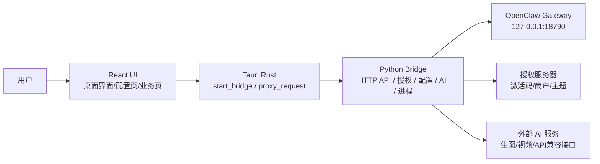

# OpenClaw U盘启动器架构复盘与后续演进建议

> 日期: 2026-05-05  
> 状态: 当前项目已进入“可交付，但需要冻结边界和持续整理”的阶段。  
> 目的: 说明当前真实架构、主要风险、短期不可乱动区域、后续模块化路线，避免项目继续被临时补丁和多模型协作改散。

---

## 1. 结论先行

当前架构不需要推倒重来。

Tauri + React + Python Bridge + OpenClaw + 授权服务器的方向是成立的，也符合这个产品的商业目标:

- 前端负责桌面 UI 和用户体验。
- Rust/Tauri 负责桌面壳、Bridge 生命周期和本地安全边界。
- Python Bridge 负责业务 API、授权调用、AI 能力和 OpenClaw 进程管理。
- OpenClaw 负责本地 AI 网关和聊天/代理能力。
- 授权服务器负责授权码、商户、主题和后续商业化管理。

真正的问题不是选型错误，而是当前代码经历了多次救火式修改，导致边界开始变模糊。

因此接下来应该采取:

1. 冻结当前可交付版本。
2. 只修影响交付的 bug。
3. 用小步重构恢复模块边界。
4. 把商业化能力逐步迁到授权服务器和配置系统。
5. 不再让任何模型或外包一次性“全项目大改”。

---

## 2. 当前真实架构

当前项目的真实运行链路如下:



### 2.1 前端层

目录:

- `src/`
- `src/components/`
- `src/services/api.ts`
- `src/providers/ThemeProvider.tsx`
- `src/theme/`

职责:

- 展示启动器 UI。
- 管理页面切换。
- 展示授权状态、服务日志、API 配置、生图、视频、广告分镜等功能。
- 通过 `src/services/api.ts` 调用 Tauri command。

当前特点:

- 前端不直接请求 Python。
- 前端统一走 `invoke('proxy_request')`。
- `api.ts` 已经加入 Bridge 自动启动和重试逻辑。
- UI 已经有主题系统雏形，但组件边界还可以继续整理。

### 2.2 Rust/Tauri 层

目录:

- `src-tauri/src/lib.rs`
- `src-tauri/tauri.conf.json`

职责:

- 启动 Python Bridge。
- 读取 Bridge 输出的端口和 token。
- 作为前端到 Python Bridge 的代理。
- 管理桌面应用窗口和资源打包。

当前特点:

- Rust 层很薄。
- Rust 现在主要做 Bridge 生命周期管理和 HTTP 转发。
- 已增加启动锁，避免 Bridge 被重复拉起。
- 已支持优先使用包内 Python Runtime。

当前短板:

- Rust 还没有承担授权验签、路径安全、进程安全等核心职责。
- 错误信息存在编码污染。
- 仍然依赖 Python 完成安全敏感逻辑。

### 2.3 Python Bridge 层

目录:

- `python/bridge.py`
- `python/core/`
- `python/services/`

职责:

- 提供本地 HTTP API。
- 调用授权管理。
- 管理 OpenClaw 进程。
- 同步 API 配置到 OpenClaw 新版模型配置。
- 调用生图、视频等外部 AI 服务。
- 管理主题配置。
- 提供日志读取。

当前特点:

- 这是目前项目最重的一层。
- 大量实际业务逻辑集中在 `bridge.py`。
- `services/process.py` 承担了 Windows 进程清理、端口占用处理、OpenClaw 启动等待等逻辑。
- 为兼容旧导入路径，仍保留 `openclaw_launcher` 假包机制。

当前短板:

- `bridge.py` 路由、业务、配置同步、主题、授权都混在一起。
- API 没有统一请求模型和响应模型。
- 进程管理逻辑比较脆弱，容易被外部全局 OpenClaw、计划任务、端口占用影响。
- 授权校验仍在 Python，长期不够安全。

### 2.4 OpenClaw 层

目录:

- `node/`
- `node_modules/openclaw/`
- `start.js`
- `data/.openclaw/`

职责:

- 运行 OpenClaw Gateway。
- 提供本地网页、聊天、代理、插件等能力。
- 监听 `127.0.0.1:18790`。

当前特点:

- 已改为 `--auth none`，避免客户被 OpenClaw 自带 token 卡住。
- 已修复 `--force` 在 Windows 下触发 `fuser/lsof` 问题。
- OpenClaw 2026.5+ 的模型配置需要写入 `models.json` 和 `openclaw.json`，不能只写旧的 `auth-profiles.json`。

当前短板:

- 外部全局安装的 OpenClaw 或 ClawPanel 可能抢占 `18790`。
- OpenClaw 自身更新较快，配置结构可能继续变化。
- 启动器需要把 OpenClaw 当作外部依赖服务来管理，而不是假设它永远稳定。

### 2.5 授权服务器层

目录:

- `license_server/server.py`
- `openclaw_new_launcher/docs/server_patched.py`
- `openclaw_new_launcher/docs/license-server-merchant-patch.py`

职责:

- 生成授权码。
- 激活授权码。
- 返回签名授权文件。
- 管理商户、主题、功能权限。
- 支持后台 Web UI。

当前特点:

- 授权服务器方向是正确的。
- Ed25519 签名链路已经具备雏形。
- 商户主题和授权码绑定已经开始规划。

当前短板:

- 服务器代码还未完全产品化。
- 管理后台、数据模型、部署脚本、备份恢复还需要正式整理。
- 客户端和服务端协议需要固定版本。

---

## 3. 当前架构的价值

这个架构有三个重要价值。

### 3.1 可以做真正离线交付

离线包包含:

- `OpenClaw.exe`
- `node/node.exe`
- `node_modules/openclaw`
- `_up_/python/bridge.py`
- `_up_/python-runtime/python.exe`
- `data/.openclaw/openclaw.json`

这意味着客户电脑不安装 Node.js、不安装 Python，也应该能运行。

### 3.2 可以做商业授权

授权码由服务器生成，客户端只保存签名授权文件。

这条路线支持:

- 一份安装包多个授权码。
- 一个授权码绑定一个客户。
- 授权码绑定设备。
- 商户主题随授权码下发。
- 后续远程禁用、续费、到期提醒。

### 3.3 可以做白标换皮

主题系统和授权系统结合后，可以做到:

- 同一个启动器底座。
- 不同商户看到不同 Logo、名称、颜色和功能入口。
- 不为每个客户单独改代码。

这是后续商业化最重要的能力之一。

---

## 4. 当前架构的主要风险

### 4.1 Bridge 过重

`python/bridge.py` 已经承担了过多职责。

风险:

- 新增接口必须修改大文件。
- 容易引入连锁 bug。
- 多模型协作时很容易互相覆盖。
- 后续测试难度高。

建议:

下一阶段拆成路由文件，但不要立刻换 FastAPI。先保持 HTTP 协议和前端 API 不变。

### 4.2 进程管理复杂

`services/process.py` 当前需要处理:

- 启动包内 Node。
- 启动 `start.js`。
- 清理 `18790` 端口。
- 停止外部 OpenClaw Gateway。
- 避免 ClawPanel 或全局 OpenClaw 抢占端口。
- 等待 OpenClaw 真正 ready。

风险:

- Windows 环境差异很大。
- 第三方软件可能复活 OpenClaw Gateway。
- 前端可能误判“已启动”。

建议:

进程管理必须单独作为高风险模块维护，任何修改都要做真实启动验证。

### 4.3 授权校验在 Python

当前授权验签在 `python/core/license_manager.py`。

短期可以接受，因为项目先要交付。

长期风险:

- Python 源码可被篡改。
- 授权守卫可以被绕过。
- 商业化后安全性不足。

建议:

v2.1 继续保持 Python 授权。

v3.0 把本地授权验签迁到 Rust。

### 4.4 打包流程不够自动化

当前打包靠人工清理和复制。

风险:

- 测试授权文件混入交付包。
- API Key 混入交付包。
- 少带 Python Runtime 或 Node。
- 打包后路径变化导致找不到文件。

建议:

必须写一键打包脚本和交付验收脚本。

### 4.5 编码污染

多个源码文件中中文字符串已经出现乱码显示。

风险:

- 用户看到乱码。
- 日志和错误提示不可读。
- 以后改动时难判断原意。

建议:

短期不因编码问题大改功能。

中期单独做一次“文案和编码清理”，不要和业务重构混在一起。

---

## 5. 不建议现在做的事

当前不建议立刻做以下事情:

- 不要立刻全量迁移 FastAPI。
- 不要立刻把所有 Python 逻辑搬到 Rust。
- 不要重写 UI。
- 不要改通信协议。
- 不要改授权服务器协议。
- 不要让模型一次性重构全项目。
- 不要为了“架构漂亮”破坏当前可交付包。

原因很简单:

现在项目已经具备交付价值，最重要的是稳定和可控。

---

## 6. 推荐演进路线

### v2.0: 交付冻结版

目标:

稳定当前离线包，可以交付、演示、销售。

允许修改:

- 启动失败。
- 授权失败。
- API Key 不保存。
- OpenClaw 端口冲突。
- 打包缺文件。
- 明显 UI 遮挡。

禁止修改:

- 不改 API 协议。
- 不改目录结构。
- 不重写 Bridge。
- 不重写 UI。
- 不替换技术栈。

完成标准:

- 解压后双击运行。
- 激活成功。
- 启动服务成功。
- 打开网页界面成功。
- API 配置重启后仍生效。
- zip 包无个人授权和个人 API Key。

### v2.1: 模块化整理版

目标:

不改变用户体验，只恢复代码边界。

建议拆分:

```text
python/
  bridge.py                 # 只负责启动 HTTP server 和分发路由
  api/
    router_process.py
    router_license.py
    router_config.py
    router_theme.py
    router_image.py
    router_video.py
    router_system.py
  core/
    paths.py
    storage.py
    license_manager.py
    theme_manager.py
  services/
    process.py
    image_api.py
    video_api.py
    updater.py
```

原则:

- 前端 API 不变。
- 返回 JSON 格式不变。
- 先拆文件，再谈框架升级。
- 每拆一个模块都要跑一次启动和授权验证。

### v2.2: 打包自动化版

目标:

把人工打包变成脚本化打包。

需要新增:

- `scripts/build-portable.ps1`
- `scripts/clean-release.ps1`
- `scripts/verify-release.ps1`

验收脚本必须检查:

- `OpenClaw.exe` 是否存在。
- `node/node.exe` 是否存在。
- `node_modules/openclaw/openclaw.mjs` 是否存在。
- `_up_/python/bridge.py` 是否存在。
- `_up_/python-runtime/python.exe` 是否存在。
- 是否无 `license.json`。
- 是否无 `install_id.txt`。
- 是否无 `.pyc` 和 `__pycache__`。
- 是否无个人 API Key。

### v3.0: 商业架构版

目标:

让项目从“可交付工具”升级为“可运营产品”。

重点:

- Rust 负责本地授权验签。
- Python 只负责 AI 和业务桥接。
- 授权服务器正式支持商户后台。
- 主题和功能权限由授权服务器下发。
- 版本更新和模板更新独立管理。

---

## 7. 层级职责最终建议

### React

只负责:

- UI。
- 用户输入。
- 页面状态。
- 错误展示。
- 主题渲染。

不负责:

- 授权验签。
- 端口清理。
- 文件系统安全。
- OpenClaw 进程细节。

### Rust/Tauri

负责:

- Bridge 生命周期。
- 本地进程安全边界。
- 后续授权验签。
- 后续安全文件读写。
- 本地系统级能力。

不负责:

- AI 业务逻辑。
- 提示词处理。
- 视频生成流程。

### Python Bridge

负责:

- 本地业务 API。
- AI 生图。
- AI 视频。
- OpenClaw 配置同步。
- OpenClaw 进程管理。
- 授权服务器通信。

后续应减少:

- 安全敏感逻辑。
- 过多路由堆积。
- UI 文案逻辑。

### OpenClaw

负责:

- 本地 AI 网关。
- 聊天与代理能力。
- 插件能力。

启动器只把它当作被管理的子服务，不应该把 OpenClaw 内部当作稳定私有 API。

### 授权服务器

负责:

- 授权码生成。
- 授权码状态。
- 设备绑定。
- 商户管理。
- 主题管理。
- 功能权限。
- 后台 Web UI。

---

## 8. 多 Agent 协作规则

后续如果使用多个模型或 Agent，必须遵守以下规则。

### 8.1 每个 Agent 只能负责一个区域

推荐分工:

- UI Agent: 只改 `src/`。
- Rust Agent: 只改 `src-tauri/`。
- Bridge Agent: 只改 `python/bridge.py` 和 `python/api/`。
- Process Agent: 只改 `python/services/process.py`。
- License Server Agent: 只改 `license_server/`。
- Packaging Agent: 只改 `scripts/` 和 `release/` 打包流程。
- Test Agent: 只做验证，不改代码。

### 8.2 禁止事项

任何 Agent 都不允许:

- 删除别人刚写的改动。
- 一次性格式化全项目。
- 同时改 UI、Bridge、Rust、授权服务器。
- 未验证就声称完成。
- 把测试授权和 API Key 打进交付包。
- 在不知道目录结构的情况下移动文件。

### 8.3 每次修改必须输出

- 修改了哪些文件。
- 为什么改。
- 如何验证。
- 是否影响打包。
- 是否影响授权。
- 是否需要用户重启应用。

---

## 9. 当前优先级列表

### P0: 交付稳定

- 启动服务稳定。
- 授权激活稳定。
- API 配置保存稳定。
- 打包清理稳定。
- 端口冲突处理稳定。

### P1: 维护性

- Bridge 拆分路由。
- 文案和编码清理。
- UI 组件整理。
- 进程管理模块加验证脚本。

### P2: 商业化

- 授权服务器后台正式化。
- 商户主题配置。
- 功能权限配置。
- 授权码批量生成和导出。

### P3: 增值功能

- 广告视频工作台。
- 分镜模板。
- 生图历史。
- 视频任务队列。
- 模板市场。

---

## 10. 推荐下一步

最推荐的下一步不是继续加功能，而是补三份工程化文件:

1. `docs/RELEASE_CHECKLIST.md`
   - 每次发包前怎么检查。

2. `docs/MODULE_BOUNDARIES.md`
   - 每层可以做什么、不可以做什么。

3. `scripts/verify-release.ps1`
   - 自动检查离线包是否缺文件、是否带敏感数据。

完成这三件事后，再进入 v2.1 的模块化整理。

---

## 11. 最终判断

当前项目不是“架构错了”，而是“架构边界被救火补丁冲淡了”。

正确处理方式是:

- 保留当前能交付的运行链路。
- 冻结用户可见行为。
- 把 Bridge 和打包流程逐步拆清楚。
- 把授权服务器产品化。
- 最后再把安全敏感逻辑迁到 Rust。

只要不再大范围乱改，这个项目可以继续发展成一个完整商业产品。

